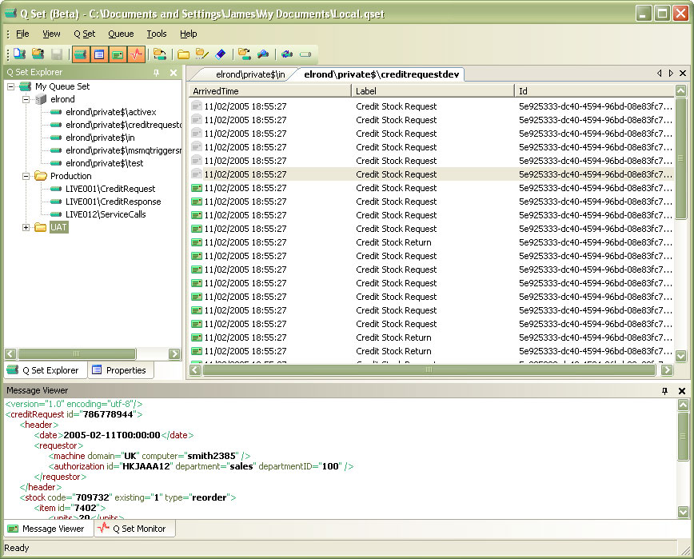
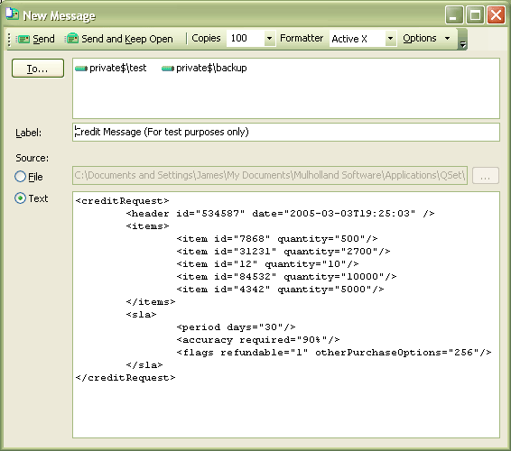
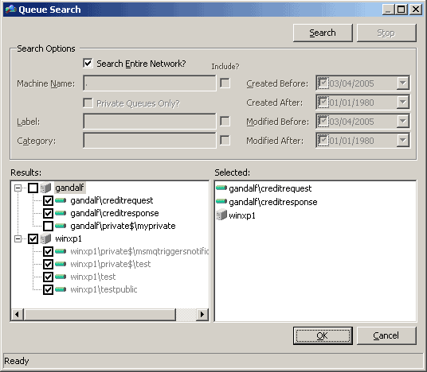

# Q-SET: MSMQ Development & Monitoring Tool

Several years ago this was a licensed product sold for a fee.  I no longer actively maintain it so have open sourced it.

It's a pretty comprehensive tool for working with MSMQ whether you are in development or admin phase.

The code is pretty clean and tidy but I wrote it a long time ago so make no apology for the lack of what might be considered common design patterns.

Also, there are a couple of libraries in use which you wont have licenses for and indeed you cannot get licenses any more.  I will try and track down the original author of those to see if there's anything that can be done in this regard.

This is a C#/WinForms project.

Features:

* Easily send (and repeat send) messages using a variety of formatters
* Inspect messages with hex, text & (custom) XSLT viewers
* Search across a domain for queues
* Custom grouping of queues
* Monitoring of queue sizes

